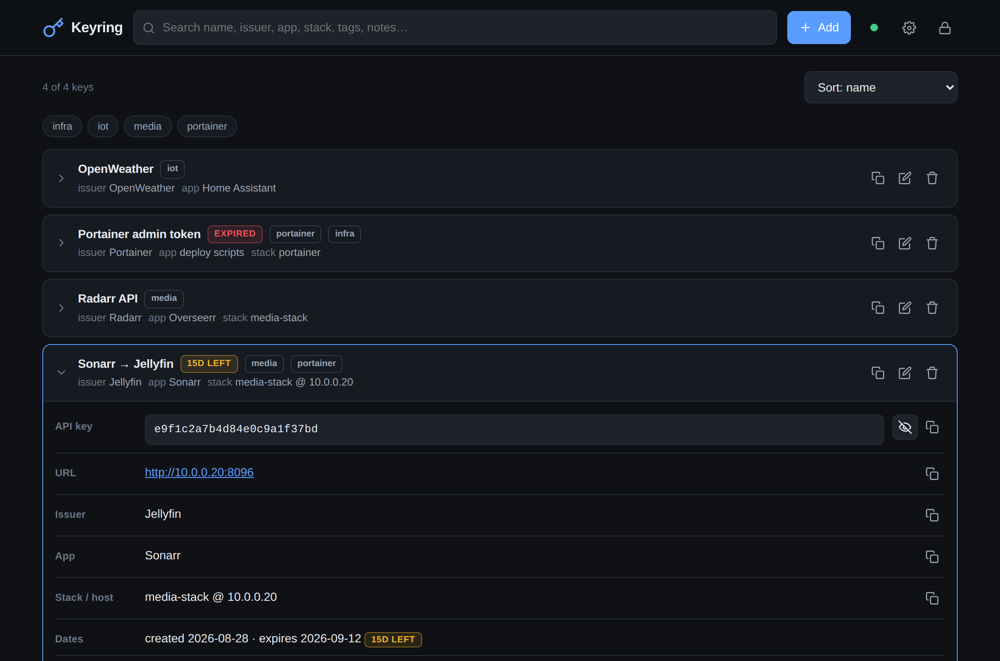
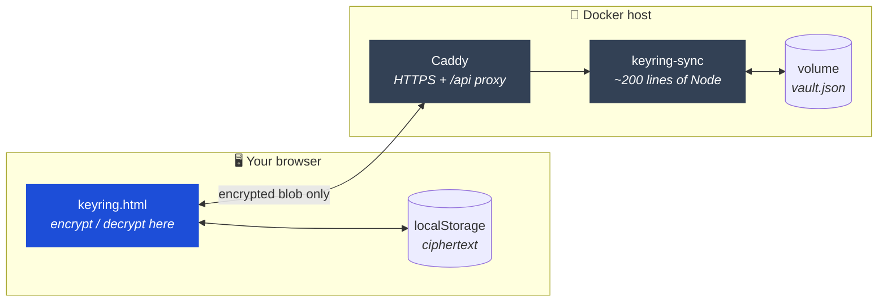
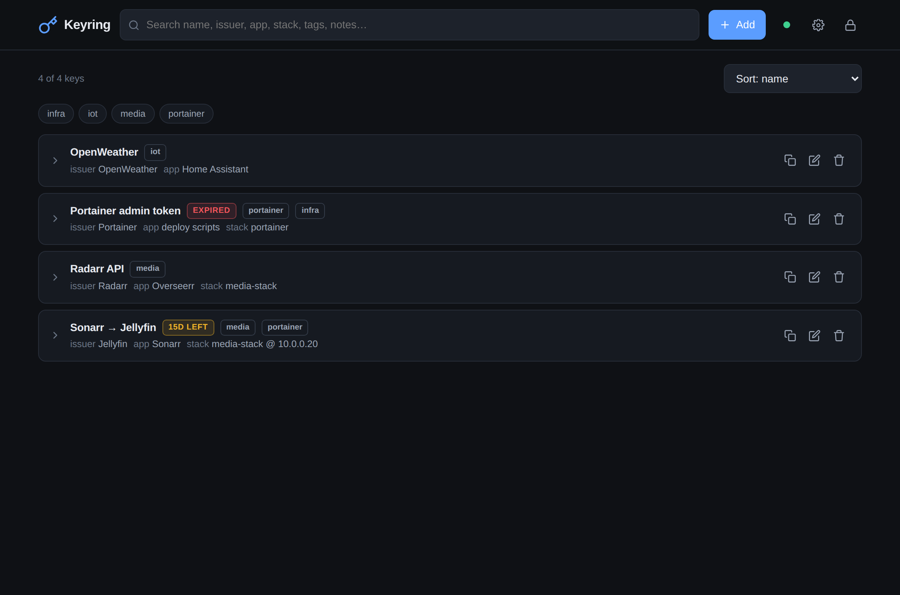
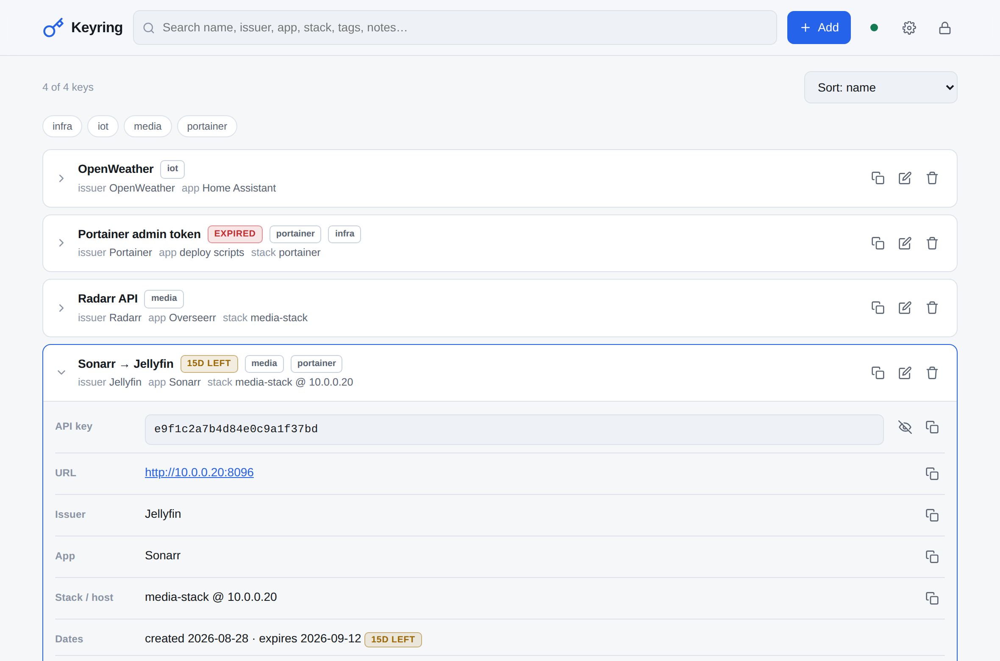

<div align="center">

# 🔑 Keyring

**A self-hosted vault for the API keys scattered across your homelab.**

Store the key, who issued it, what uses it, which stack it belongs to, when it expires —
and copy any of it with one click. Encrypted in your browser before it touches disk.

[](https://github.com/MrSossidge/keyring-vault/actions/workflows/ci.yml)
[](LICENSE)
[](#no-dependencies)
[](SECURITY.md)
[](https://www.buymeacoffee.com/MrSossidge)



</div>

---

## The problem

Every service issues its own key and then hides it somewhere different. Sonarr wants
Jellyfin's key. Overseerr wants Radarr's. Home Assistant wants OpenWeather's. Six months
later you need one of them again and you're clicking through six admin panels trying to
remember which one issued it.

Keyring is one page that holds all of them, with the context you actually need to use
them — and a copy button on every single value.

## What you get

| | |
|---|---|
| 🔒 **Encrypted at rest** | AES-256-GCM with a key derived from your master password via PBKDF2-SHA256 (310,000 iterations). Encryption happens in the browser. |
| 📋 **Copy everything** | One click on any key, secret, URL or field. Falls back to `execCommand` where the clipboard API is unavailable. |
| 🏷️ **Built for a homelab** | Issuer, consuming app, stack/host, URL, tags, created and expiry dates, free-text notes. |
| ⏰ **Expiry warnings** | Amber inside 30 days, red once it's gone. Sort the whole list by expiry. |
| 🔍 **Instant search** | Across every field except the secrets themselves, plus tag filter chips. |
| 🔄 **Multi-device sync** | Optional. The server stores ciphertext and cannot read it. Concurrent edits merge. |
| 🌗 **Dark and light** | Auto-lock on idle, optional clipboard auto-clear, keyboard shortcuts. |
| 📦 **One file** | The whole app is a single HTML file. No build step, no framework, no CDN. |

## How it fits together



The blue box is the only place your keys exist in readable form. Everything crossing the
arrow to the right is already encrypted, so the server, its disk and its backups only ever
hold a blob that is useless without your master password.

---

## Quick start

### Deploy with Portainer

Portainer's web editor doesn't support relative bind mounts, so the files go on the Docker
host first and the compose file points at them absolutely.

**1.** On the Docker host:

```bash
sudo mkdir -p /opt/keyring/site /opt/keyring/sync
```

**2.** Copy three files across so you end up with exactly this:

```
/opt/keyring/Caddyfile
/opt/keyring/sync/server.js
/opt/keyring/site/keyring.html
```

**3.** Edit the first line of `/opt/keyring/Caddyfile` — it names the address you'll browse
to. Change `10.0.0.20` if your host differs.

**4.** In Portainer: **Stacks → Add stack → Web editor**, paste `docker-compose.yml`,
**Deploy**.

**5.** Go to `https://<your-host>:8121`, accept the certificate once, and create your vault.

> **Updating later:** replace `/opt/keyring/site/keyring.html` and hard-refresh. Caddy
> serves it straight off the mount — nothing to redeploy.

### Or just open the file

`site/keyring.html` is fully functional on its own. Double-click it. You get the whole app,
encrypted, with no sync and nothing to install.

<details>
<summary><b>Why HTTPS isn't optional</b></summary>

Browsers only expose the WebCrypto and clipboard APIs in a **secure context**.
`http://10.0.0.20:8080` is not one, so the page physically cannot encrypt anything there.
It will tell you so rather than quietly storing your keys in plain text.

These all qualify as secure: `https://` (including self-signed), `localhost`, and `file://`.
That's why the stack runs Caddy with `tls internal` — you accept the certificate once per
machine and everything works from then on.
</details>

<details>
<summary><b>Serving on a bare IP address needs <code>default_sni</code></b></summary>

A browser never sends SNI when the URL is an IP address rather than a hostname.
Caddy's fallback is to pick a certificate using the connection's local address — but
behind Docker's NAT that is the container's internal address, not your LAN IP. Caddy
then holds a valid certificate it cannot match, and aborts the handshake:

```
tlsv1 alert internal error ... no peer certificate available
```

which the browser reports as the not-very-helpful `ERR_SSL_PROTOCOL_ERROR`. The global
option in the Caddyfile is what fixes it:

```
{
	default_sni 10.0.0.20
}
```

If you front this with a reverse proxy on a real hostname instead, the problem disappears
on its own — the browser sends SNI and Caddy has something to match.
</details>

<details>
<summary><b>A note on origins</b></summary>

Browser storage is per-origin. `file:///…/keyring.html` and `https://10.0.0.20:8121` are
different origins with completely separate vaults. Pick one and stay with it, or move
between them using the encrypted export/import in the menu.
</details>

---

## Sync

Off by default and entirely optional — without it, each browser keeps its own vault.

Turn it on and every browser pushes its encrypted blob to `/api/vault`. Open the page on a
second machine and you'll get the unlock screen instead of the create screen, because it
found the server's copy.

**When two devices edit at once**, the stale write gets a `409` from the ETag check. The
page then pulls the server's version, decrypts it with your master password, merges
entry-by-entry on last-write-wins, and pushes the result. Deletes carry tombstones, so a key
you removed on one device won't be resurrected by another device's stale copy.

There's a status dot in the header — green synced, amber unreachable, red error — and a
60-second background poll to pick up changes from elsewhere.

### Configuration

| Variable | Default | What it does |
|---|---|---|
| `KEYRING_DATA` | `/data` | Where `vault.json` and version snapshots live |
| `KEYRING_TOKEN` | *(empty)* | Shared bearer token. Empty means an open endpoint |
| `KEYRING_KEEP` | `10` | How many previous versions to retain |
| `KEYRING_UID` | *(unset)* | `uid:gid` to drop to after taking ownership of the data dir |
| `KEYRING_ALLOW_PLAINTEXT` | *(unset)* | Set to `1` to accept unencrypted vaults. Don't |

> The token guards the *slot*, not the contents. It stops a stranger on your network
> overwriting or fetching the blob; it does nothing for confidentiality, because the blob is
> already useless without your master password.

### API

| Method | Path | |
|---|---|---|
| `GET` | `/api/vault` | The stored record. `404` if none yet |
| `PUT` | `/api/vault` | Replace it. Send `If-Match: <etag>` |
| `DELETE` | `/api/vault` | Remove it. A snapshot is kept |
| `GET` | `/api/health` | `{"ok":true}` |

Any record with `enc !== true` is rejected, so an unencrypted vault can never end up on the
server's disk.

---

## Security

The short version: your keys are encrypted before they leave the tab, the server holds
ciphertext it has no way to read, and there is **no password recovery** — forget the master
password and the data is genuinely gone.

The longer version, including what this does and does not protect you against, is in
**[SECURITY.md](SECURITY.md)**. Worth two minutes before you put real keys in it.

**Back up occasionally.** Menu → *Export encrypted backup*. The file stays encrypted and
still needs your master password, so it's safe to keep anywhere.

---

## Screenshots

<div align="center">

&nbsp;

</div>

---

## Development

<a name="no-dependencies"></a>
**Nothing to install to run it.** The app is one HTML file with no framework, no bundler and
no CDN. The sync server is one Node file using only the standard library. Playwright is a
dev dependency for the tests and nothing else.

```bash
npm install          # playwright, for the tests only
npx playwright install --with-deps chromium
npm test             # 50 checks across two suites
```

The suites drive a real browser against the real server:

- **`test/local.test.js`** — encryption round-trip, CRUD, masking, copy, search, lock/unlock,
  wrong-password rejection, password rotation, encrypted backup and restore, and that the
  page refuses to store plaintext when WebCrypto is unavailable.
- **`test/sync.test.js`** — two independent browser profiles against a live server:
  propagation both ways, deletes that stay deleted, a forced concurrent-edit conflict that
  merges instead of clobbering, and that the bytes on disk contain no key value or entry name.

```bash
node test/screenshots.js   # regenerate docs/screenshots
```

## Layout

```
├── site/keyring.html      the entire app
├── sync/server.js         the blob store
├── docker-compose.yml     Portainer stack
├── Caddyfile              HTTPS + /api proxy
└── test/                  browser test suites
```

## Support

If Keyring saved you some clicking about, you can buy me a coffee.

<a href="https://www.buymeacoffee.com/MrSossidge"></a>

## Licence

MIT — see [LICENSE](LICENSE).
